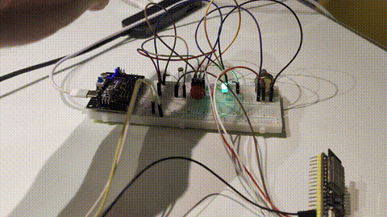

У цьому експерименті проста систем освітлення з двома режимами з перемиканням кнопкою. У першому режимі на освітленість реагує фоторезистор і управляє світлодіодом. У другому режимі регулювання за допомогою потенціометра.

